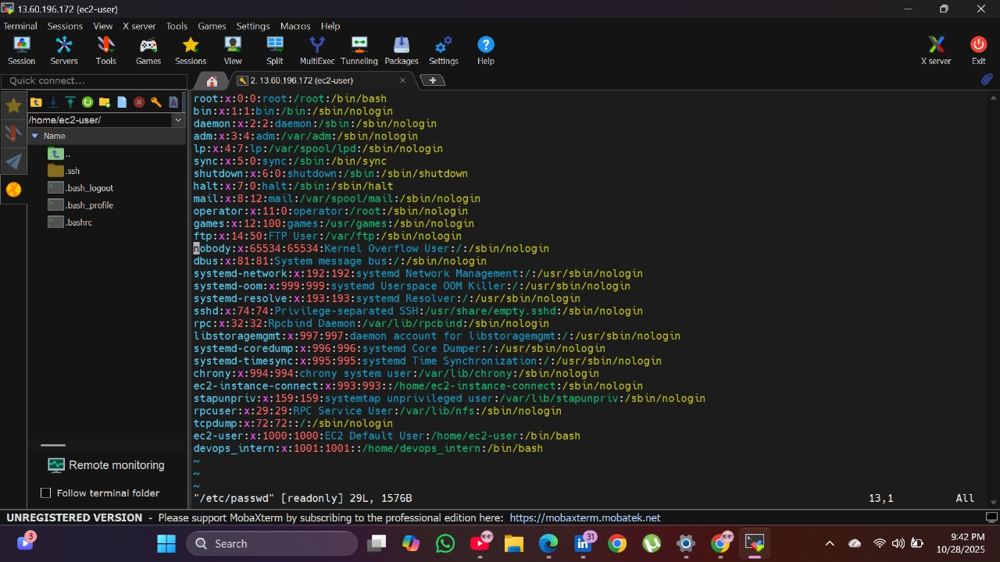
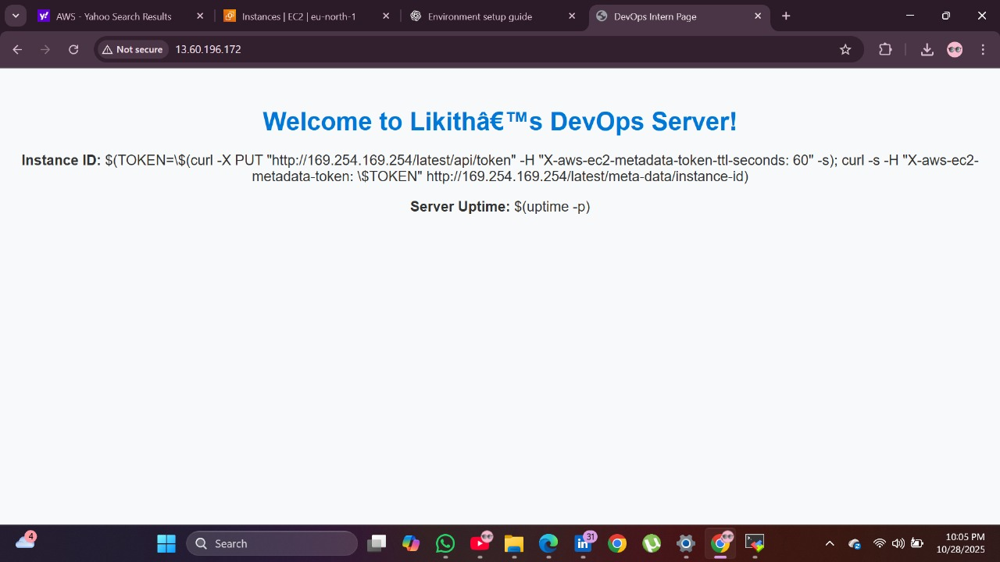
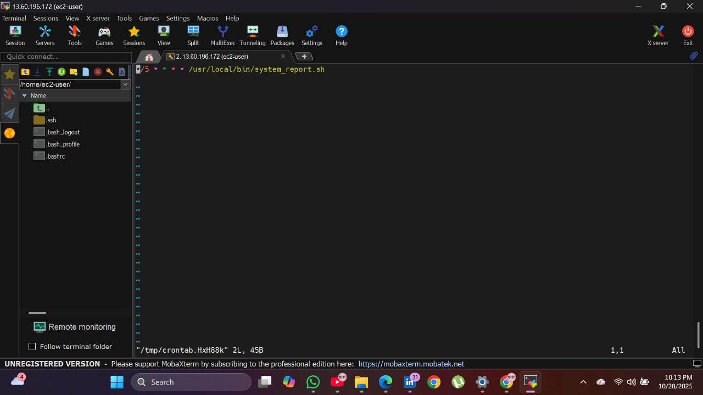
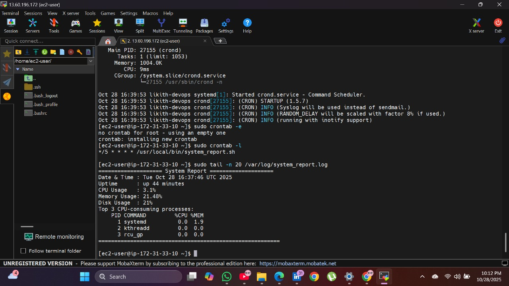
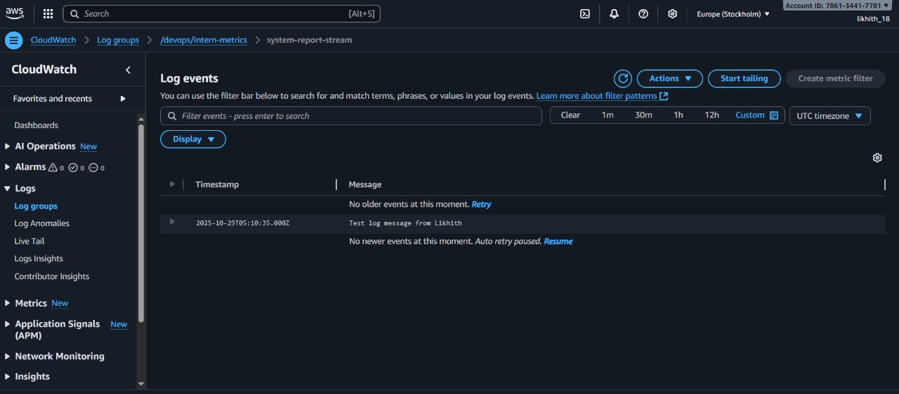

# DevOps Intern Assignment - Powerplay

This repository contains my completed **DevOps Internship Assessment** for **Powerplay**.  
The project demonstrates my practical understanding of **Linux administration, AWS EC2 setup, automation scripting, and system monitoring**.

---

## Part 1: Environment Setup

**Objective:** Launch and configure an EC2 instance for DevOps tasks.

**Steps Followed:**
1. Created a new **AWS EC2 Instance** using **Amazon Linux 2** in the `eu-north-1 (Stockholm)` region.
2. Configured **security groups** to allow SSH (port 22) access.
3. Connected to the instance securely via **MobaXterm** using the `.pem` key.
4. Verified connectivity and system information using:
   ```bash
   hostnamectl
   whoami
   cat /etc/os-release


---

## ⚙️ Part 2: System Configuration

### **Objective:**  
Create and manage users with administrative privileges.

### **Steps:**
1. Added a new user `devops_intern` and assigned sudo rights.  
2. Verified entry in `/etc/passwd`.  
3. Tested by switching users.

📸 **Screenshot:**  


---

## 🌐 Part 3: Web Server Setup

### **Objective:**  
Deploy a simple HTML web page using Apache.

### **Steps:**
1. Installed Apache:
   ```bash
   sudo yum install httpd -y
   sudo systemctl start httpd
   sudo systemctl enable httpd
   2. Created a simple HTML page:
   ```html
   <h1>Welcome to Likhith’s DevOps Server!</h1>
   <p>This page is hosted on an EC2 instance for Powerplay Internship Assessment.</p>


3. Verified by accessing the EC2 Public IP in the browser.

📸 **Screenshot:**  


---

## ⚡ Part 4: Automation Script & Cron Job

### **Objective:**  
Automate system status logging using a bash script and cron.

### **Steps:**

1. Created a bash script `system_report.sh`
   ```bash
   #!/bin/bash
   echo "System Report generated on: $(date)"
   echo "----------------------------------"
   echo "Hostname: $(hostname)"
   echo "Uptime:"
   uptime
   echo "Disk Usage:"
   df -h
  Made it executable:
  chmod +x system_report.sh
Scheduled it to run every 5 minutes:
crontab -e
   Added this line:
*/5 * * * * /home/ec2-user/system_report.sh >> /home/ec2-user/report.log 2>&1
4. Verified that the script executed automatically and logs were updated.

📸 **Screenshots:**  
  
  


---

## 🧾 Part 5: Documentation & Cleanup

### **Objective:**  
Summarize the project and ensure proper cleanup of AWS resources.

### **Steps:**
1. Documented all setup steps and configurations in this `README.md`.  
2. Added all screenshots to the `/screenshots/` folder.  
3. Terminated the EC2 instance after verifying logs and outputs to prevent unnecessary charges.

📸 **Screenshot:**  


---

## 🧠 Key Learnings

- Launching and managing AWS EC2 instances  
- User administration and permission handling in Linux  
- Installing and hosting a website using Apache  
- Writing bash scripts for automation  
- Using cron jobs for periodic task execution  
- Monitoring and verifying logs using AWS CloudWatch  
- Maintaining clear technical documentation on GitHub  

---

## 📂 Repository Structure


